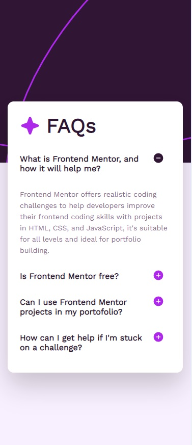
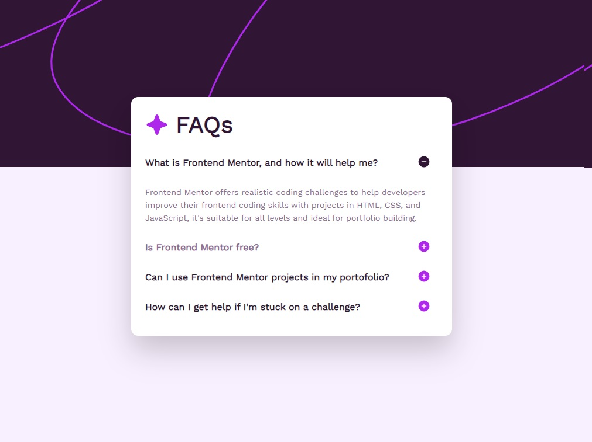

# Frontend Mentor - FAQ accordion solution

This is a solution to the [FAQ accordion challenge on Frontend Mentor](https://www.frontendmentor.io/challenges/faq-accordion-wyfFdeBwBz).

## Table of contents

- [Overview](#overview)
  - [The challenge](#the-challenge)
  - [Screenshot](#screenshot)
  - [Links](#links)
- [My process](#my-process)
  - [Built with](#built-with)
  - [What I learned](#what-i-learned)

## Overview

### The challenge

Users should be able to:

- Hide/Show the answer to a question when the question is clicked
- Navigate the questions and hide/show answers using keyboard navigation alone
- View the optimal layout for the interface depending on their device's screen size
- See hover and focus states for all interactive elements on the page

### Screenshot

 

### Links

- Solution URL: [Add solution URL here](https://your-solution-url.com)
- Live Site URL: [Add live site URL here](https://your-live-site-url.com)

## My process

For simple accordion effect, I am toggling the faq' property value (displayed).

I map the FAQs content to have property displayed.

```js
public faqs = FAQS.map((faq) => ({ ...faq, displayed: false }));
```

I can then toggle the displayed property via the template statement that I bind in the question container.

```html
<div class="question" (click)="showFaq(i)"></div>
```

Then I add structural directive (\*ngIf) in the icon to decide which Icon should be displayed.

```html
<button mat-icon-button>
  <svg-icon *ngIf="!faq.displayed" src="assets/images/icon-plus.svg" alt="icon-closed"></svg-icon>
  <svg-icon *ngIf="faq.displayed" src="assets/images/icon-minus.svg" alt="icon-opened"></svg-icon>
</button>
```

### Built with

- Angular Material
- Angular SVG Icon

### What I learned

We should use max-height instead of height for transitioning the accordion height. Fix height will transition fine, but the height will not match the content.

```css
.answer {
  color: hsl(292, 16%, 49%);
  max-height: 170px;
  opacity: 1;
  transition: max-height 0.2s ease-in, opacity 0.2s ease-in;
  font-size: 14px;
  line-height: 22px;

  &.hidden {
    max-height: 0;
    opacity: 0;
    overflow: hidden;
    transition: max-height 0.3s ease-out, opacity 0.2s ease-in;
  }
}
```
