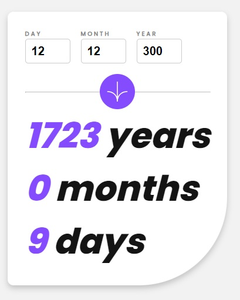

# Frontend Mentor - Age calculator app solution

This is a solution to the [Age calculator app challenge on Frontend Mentor](https://www.frontendmentor.io/challenges/age-calculator-app-dF9DFFpj-Q). Frontend Mentor challenges help you improve your coding skills by building realistic projects.

## Table of contents

- [Overview](#overview)
  - [The challenge](#the-challenge)
  - [Screenshot](#screenshot)
  - [Links](#links)
- [My process](#my-process)
  - [Built with](#built-with)
  - [What I learned](#what-i-learned)

## Overview

### The challenge

Users should be able to:

- View an age in years, months, and days after submitting a valid date through the form
- Receive validation errors if:
  - Any field is empty when the form is submitted
  - The day number is not between 1-31
  - The month number is not between 1-12
  - The date is in the future
  - The date is invalid e.g. 31/04/1991 (there are 30 days in April)
- View the optimal layout for the interface depending on their device's screen size
- See hover and focus states for all interactive elements on the page

### Screenshot

 

### Links

- Live Site URL: [https://satutama.github.io/fe-challenges/age-calculator](https://satutama.github.io/fe-challenges/age-calculator)

## My process

### Built with

- Angular
- HTML
- SCSS

### What I learned

On this assignment, I used Angular Reactive Forms. Why not a template-driven form? Because we need to add some validations logic which can not be managed solely in the template.

For checking the valid date, I added a date-validator directive which then added as a group validator

```js
// dateValidator directive
export const dateValidator: ValidatorFn = (control: AbstractControl): ValidationErrors | null => {
  const day = control.get("day")?.value;
  const month = control.get("month")?.value;
  const year = control.get("year")?.value;

  if (!day || !month || !year) {
    return null;
  }

  const isValidDate = moment(`${year}/${month}/${day}`, "Y/M/D").isValid();

  return !isValidDate ? { invalidDate: true } : null;
};
```

```js
public birthdayForm = new FormGroup(
    {
      day: new FormControl('', [...this.basicValidators, Validators.max(31)]),
      month: new FormControl('', [...this.basicValidators, Validators.max(12)]),
      year: new FormControl('', [
        ...this.basicValidators,
        Validators.max(this.currentYear),
      ]),
    },
    { validators: dateValidator } // dateValidator as a group validation
  );
```

I'm using moment.js for helping me formating the date inputs. These inputs then calculated to get the difference between today and the birthdate.

Another thing, to have the input fields not overflowing when in mobile view, I set the `max-width` of the form-group and added `min-width : 0` in the flex item.

I also have `isInvalid` method to minimize repetition in the template.
