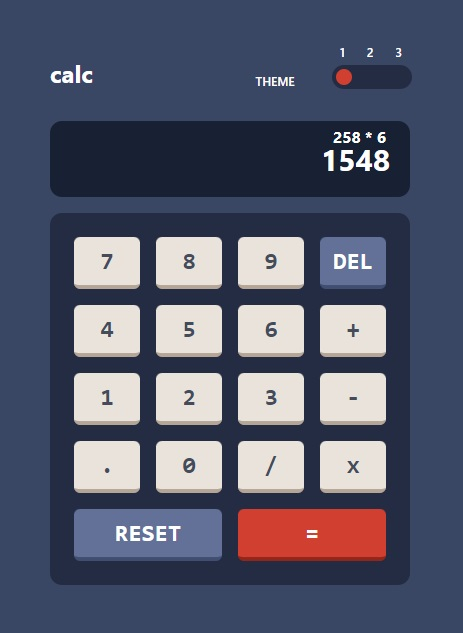
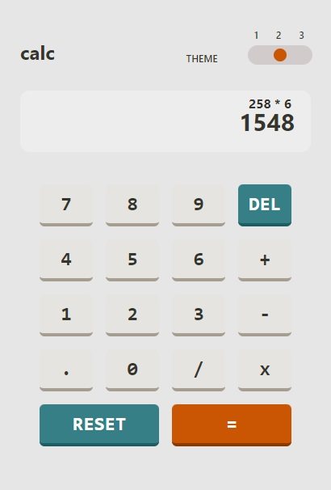
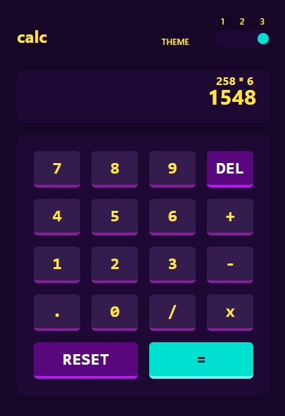

# Frontend Mentor - Calculator app solution

This is a solution to the [Calculator app challenge on Frontend Mentor](https://www.frontendmentor.io/challenges/calculator-app-9lteq5N29). Frontend Mentor challenges help you improve your coding skills by building realistic projects.

## Table of contents

- [Overview](#overview)
  - [The challenge](#the-challenge)
  - [Screenshot](#screenshot)
  - [Links](#links)
- [My process](#my-process)
  - [Built with](#built-with)
  - [What I learned](#what-i-learned)

**Note: Delete this note and update the table of contents based on what sections you keep.**

## Overview

### The challenge

Users should be able to:

- See the size of the elements adjust based on their device's screen size
- Perform mathmatical operations like addition, subtraction, multiplication, and division
- Adjust the color theme based on their preference
- **Bonus**: Have their initial theme preference checked using `prefers-color-scheme` and have any additional changes saved in the browser

The designs inside the `/design` folder

### Screenshot

### Links

- Solution URL: https://github.com/satutama/fe-challenges/tree/master/src/app/challenges/calculator
- Live Site URL: https://satutama.github.io/fe-challenges/calculator

## My process

### Built with

- Angular
- Signal
- Tailwind

### What I learned

Using signal to manage the state of the calculator view.

Using @apply in tailwind to set different themes with the help of class binding from Angular.
