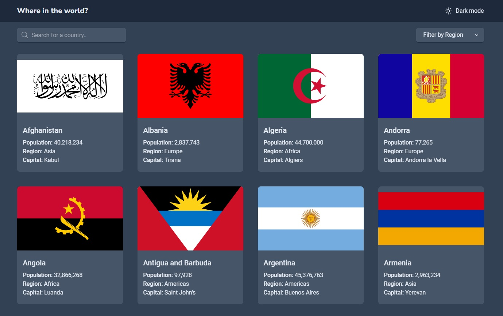
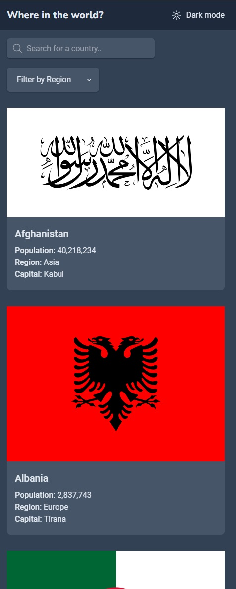
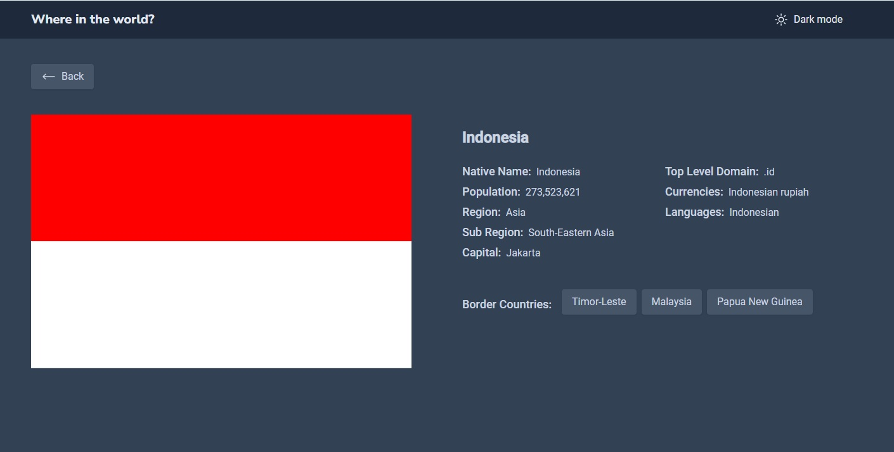
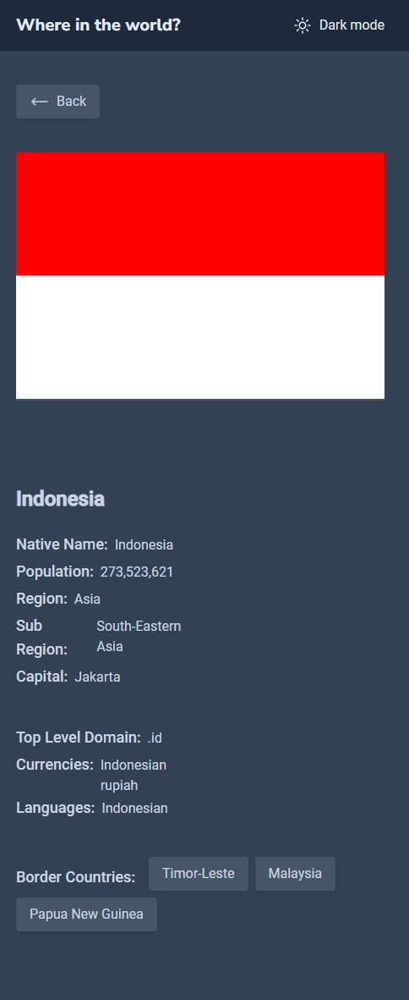

# Frontend Mentor - REST Countries API with color theme switcher solution

This is a solution to the [REST Countries API with color theme switcher challenge on Frontend Mentor](https://www.frontendmentor.io/challenges/rest-countries-api-with-color-theme-switcher-5cacc469fec04111f7b848ca). Frontend Mentor challenges help you improve your coding skills by building realistic projects.

## Table of contents

- [Overview](#overview)
  - [The challenge](#the-challenge)
  - [Screenshot](#screenshot)
  - [Links](#links)
- [My process](#my-process)
  - [Built with](#built-with)
  - [What I learned](#what-i-learned)
  - [Continued development](#continued-development)

## Overview

### The challenge

Users should be able to:

- See all countries from the API on the homepage
- Search for a country using an `input` field
- Filter countries by region
- Click on a country to see more detailed information on a separate page
- Click through to the border countries on the detail page
- Toggle the color scheme between light and dark mode _(optional)_

### Screenshot






### Links

- Solution URL: [Add solution URL here](https://github.com/satutama/fe-challenges/tree/master/src/app/challenges/countries)
- Live Site URL: [Add live site URL here](https://satutama.github.io/fe-challenges/countries)

## My process

- Add Countries routes to handle the routing of the countries components
- Using loadchildren, lazy load the newly created Countries routes
- Refactor countries component and extract country-list component.
- Style update and add the dark mode style

### Built with

- Angular 16
- Tailwind

### What I learned

Using keyvalue pipe to show regions enum in template (the region filter button)

```html
<select name="region" id="region" class="appearance-none shadow-sm shadow-slate-200 row-start-1 col-start-1 pl-5 pr-14 rounded-md dark:bg-slate-600 dark:shadow-slate-800 dark:text-slate-200" [formControl]="region">
  <option disabled hidden value="">Filter by Region</option>
  <option *ngFor="let region of regions | keyvalue" [value]="region.value">{{ region.key }}</option>
</select>
```

Since the common native name has dynamic key, parsing is needed in the countriesService to set the commonNativeName, which then is used in the country component

The languages has dynamic keys as well, below is how I set the languages in template

```html
<span *ngFor="let language of country.languages | keyvalue as languages;index as i">
  {{ language.value }}
  <span *ngIf="i < languages.length - 1">,&nbsp;</span>
</span>
```

Added enum for countries code to parse the borders.

Adding dark mode.

1. Update tailwind config: Add darkMode: 'class' (this should be placed before the theme)
2. Add HostBinding which add dark class based on the darkMode signal
3. Add dark classes in template
4. Add effect in the constructor to set the darkMode in the local storage
5. Update darkmode signal to use the value from local storage

### Continued development

- Refactor Country model to CountryDto and Country. CountryDto is the expected model response, and the Country is the model that should be used accross components. So Parsing the response should be refactored as well.
- Add sorting by population
- Add sorting by name
- Add filter option 'Traveled'
