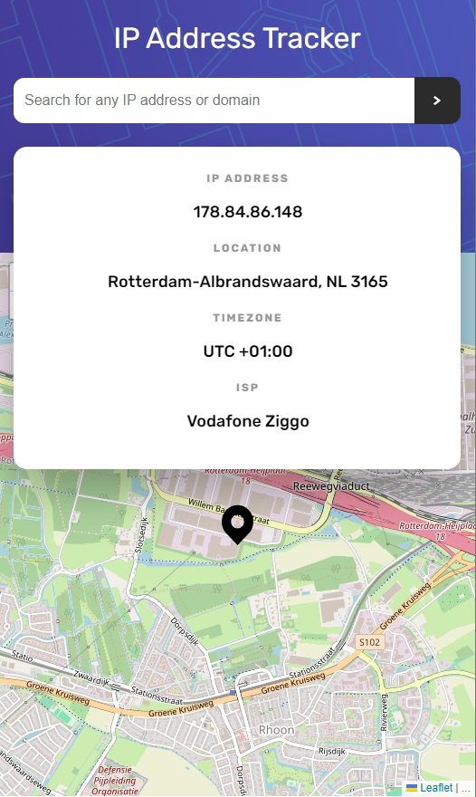
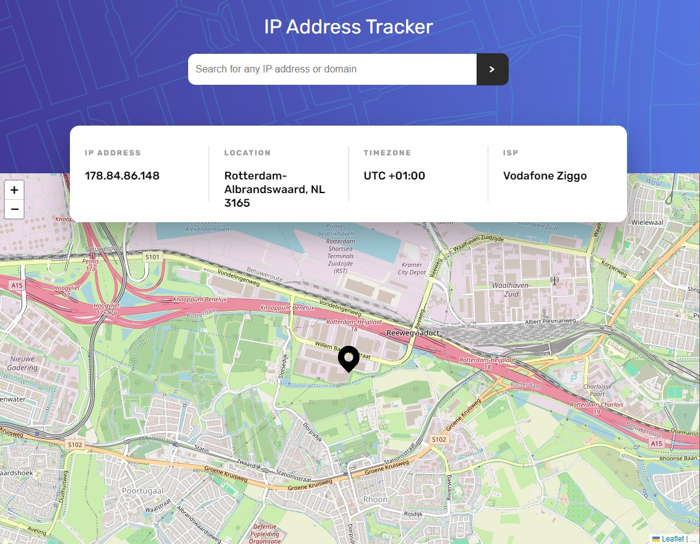

# Frontend Mentor - Age calculator app solution

This is a solution to the [IP address tracker challenge on Frontend Mentor](https://www.frontendmentor.io/challenges/ip-address-tracker-I8-0yYAH0). Frontend Mentor challenges help you improve your coding skills by building realistic projects.

## Table of contents

- [Overview](#overview)
  - [The challenge](#the-challenge)
  - [Screenshot](#screenshot)
  - [Links](#links)
- [My process](#my-process)
  - [Built with](#built-with)
  - [What I learned](#what-i-learned)

## Overview

### The challenge

Users should be able to:

- View the optimal layout for each page depending on their device's screen size
- See hover states for all interactive elements on the page
- See their own IP address on the map on the initial page load
- Search for any IP addresses or domains and see the key information and location

### Screenshot

 

### Links

- Live Site URL: [https://satutama.github.io/fe-challenges/age-calculator](https://satutama.github.io/fe-challenges/age-calculator)

## My process

### Built with

- Angular
- HTML
- SCSS

### What I learned

I added a validation directive to validate the input. To be able to validate a domain name or an IP address.

For the IP validation I am using this regex

```js
const ipRe = new RegExp("^(([0-9]|[1-9][0-9]|1[0-9]{2}|2[0-4][0-9]|25[0-5]).){3}([0-9]|[1-9][0-9]|1[0-9]{2}|2[0-4][0-9]|25[0-5])$");
```

1. ^: Asserts the start of the string.
2. ( and ): Capturing group for the entire IP address.
3. ([0-9]|[1-9][0-9]|1[0-9]{2}|2[0-4][0-9]|25[0-5]): This part defines a single octet (segment) of the IP address. Let's break down the options:
   - [0-9]: Matches a single digit.
   - [1-9][0-9]: Matches two digits where the first digit is non-zero.
   - 1[0-9]{2}: Matches three digits where the first digit is '1'.
   - 2[0-4][0-9]: Matches three digits where the first digit is '2' and the second digit is between '0' and '4'.
   - 25[0-5]: Matches three digits where the first two digits are '25' and the third digit is between '0' and '5'.
4. (.): Matches a dot after each octet.
5. {3}: Specifies that the preceding group (octet and dot) should repeat exactly three times.
6. ([0-9]|[1-9][0-9]|1[0-9]{2}|2[0-4][0-9]|25[0-5]): Similar to the octet pattern for the last part of the IP address.
7. $: Asserts the end of the string.

There are 2 services, the map service to handle map related function and the IP address tracker service to get the IP details with HTTP request.

In the component, we define the ipAddress$ with the observable from the Ip address service. In the Ip address service, we define the IP details with merge operator of initialIPDetails and searchedIPdetails. The searchedIPdetails listened to the domain subject which get called from the component.

### What can be improved

- loading state
- error state
- extract the URL from the service
