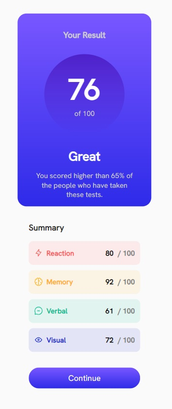
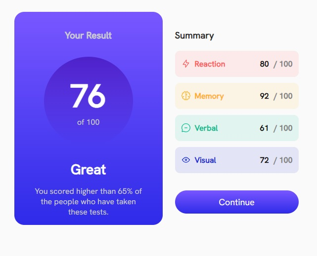

# Frontend Mentor - Results summary component solution

This is a solution to the [Results summary component challenge on Frontend Mentor](https://www.frontendmentor.io/challenges/results-summary-component-CE_K6s0maV). Frontend Mentor challenges help you improve your coding skills by building realistic projects.

## Table of contents

- [Overview](#overview)
  - [The challenge](#the-challenge)
  - [Screenshot](#screenshot)
  - [Links](#links)
- [My process](#my-process)
  - [Built with](#built-with)
  - [What I learned](#what-i-learned)

## Overview

### The challenge

Users should be able to:

- View the optimal layout for the interface depending on their device's screen size
- See hover and focus states for all interactive elements on the page
- **Bonus**: Use the local JSON data to dynamically populate the content

### Screenshot

 

Add a screenshot of your solution. The easiest way to do this is to use Firefox to view your project, right-click the page and select "Take a Screenshot". You can choose either a full-height screenshot or a cropped one based on how long the page is. If it's very long, it might be best to crop it.

Alternatively, you can use a tool like [FireShot](https://getfireshot.com/) to take the screenshot. FireShot has a free option, so you don't need to purchase it.

Then crop/optimize/edit your image however you like, add it to your project, and update the file path in the image above.

**Note: Delete this note and the paragraphs above when you add your screenshot. If you prefer not to add a screenshot, feel free to remove this entire section.**

### Links

- Live Site URL: [https://satutama.github.io/fe-challenges/result-summary](https://satutama.github.io/fe-challenges/result-summary)

## My process

### Built with

- Angular
- HTML
- SCSS

### What I learned

On this assignment, I only used CommonModule from Angular. So I rely all styling on CSS and HTML.

To achieve different view for mobile, I'm using

```css
flex-wrap: wrap;
```

This allows the summary to be placed below the result when the screen is too small for both to be displayed next to each other.

To add the gap between items in the summary, I'm using element + element Selector. This select and style the first element that are placed immediately after 'item' elements.

```css
.item {
  ... + .item {
    margin-top: 12px;
  }
}
```

For the different colors on the item, I'm using :has() CSS psuedo-class. This presents a ways of selecting a parent element or a previous sibling element with respect to a reference to a reference element by taking a relative selector list as an argument.

```css
&:has(.reaction) {
  background-color: hsla(0, 100%, 67%, 0.1);
  color: hsla(0, 100%, 67%);
}
```
